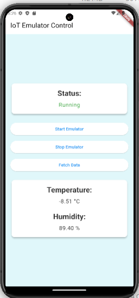

# C++ Emulator - Simulates IoT device

This project consists of a Node.js server and a C++ client to simulate a temperature and humidity sensor. The server can start, stop, and fetch data from the emulator.

## Prerequisites

- Node.js and npm
- C++ compiler (e.g., g++)
- Boost library
- JsonCpp library
- Andriod Studio
- Andriod Emulator
- Flutter

## Installation

1. **Install Node.js and npm**: Follow the instructions on the [Node.js website](https://nodejs.org/) to install Node.js and npm.

2. **Clone the repository**:
   ```sh
   git clone https://github.com/Ajay-Kanojiya/neuronic_challenge.git
   cd neuronic_challenge

3. **Install dependencies**:
    ```sh
    npm init -y
    npm install socket.io net body-parser express cors
    sudo apt-get install libboost-all-dev
    sudo apt-get install libjsoncpp-dev

4. **Compile the C++ script**:
    ```sh
    cd emulator
    g++ -o SensorEmulator SensorEmulator.cpp -lboost_system -lpthread -ljsoncpp

## Running the project

1. Start the Node.js server:
    ```sh
    cd server
    node server.js

2. Run the C++ client:
    ```sh
    cd emulator
    ./SensorEmulator

3. Run ioTEmulatorCtrl.apk

    

#### Note: If you install app in andriod phone then values will not be updated because it used the localhost to hit the API.

## API Endpoints

1. Start the Emulator

    * Endpoint: ```http://127.0.0.1:3001/start``
    * Method: ```POST```
    * Description: Sends the start command to the emulator to begin data generation.

2. Stop the Emulator

    * Endpoint: ```http://127.0.0.1:3001/start```
    * Method: ```POST```
    * Description: Sends the stop command to the emulator to stop data generation.    

3. Fetch Latest Data

    * Endpoint: ```http://127.0.0.1:3001/fetch_data```
    * Method: ```GET```
    * Description: Fetches the latest temperature and humidity data from the emulator.    